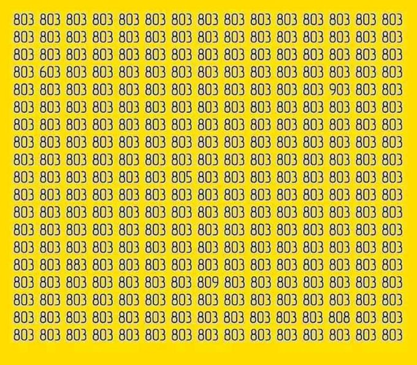
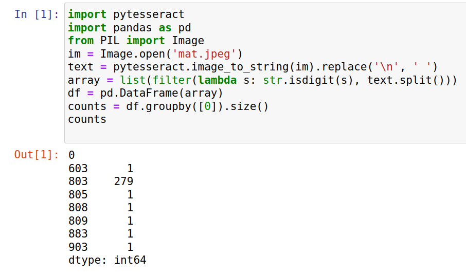

# mat_ocr

This is a fun project for a LinkedIn education account. They have published an image which contains some numbers and asked their followers to find the outliers.  

I came up with this little project.  

You can see their question in their post here: https://www.linkedin.com/feed/update/urn:li:activity:6957714495871827969/#

This is their original image  

  

And this is my solution to their counting problem  

